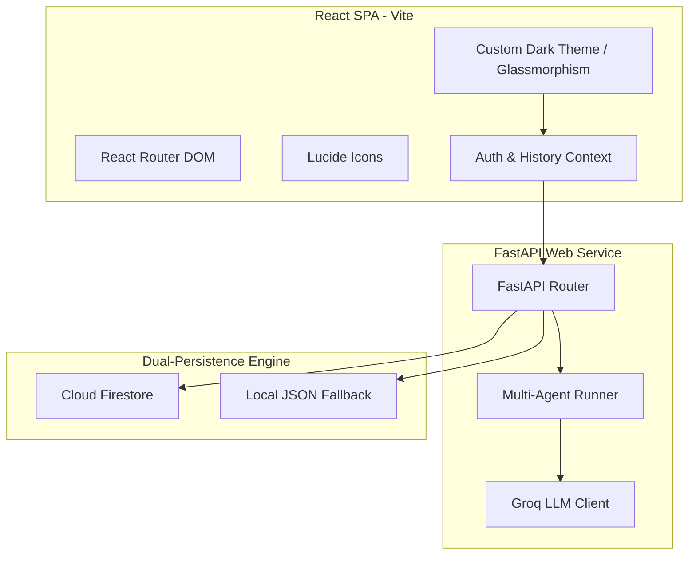
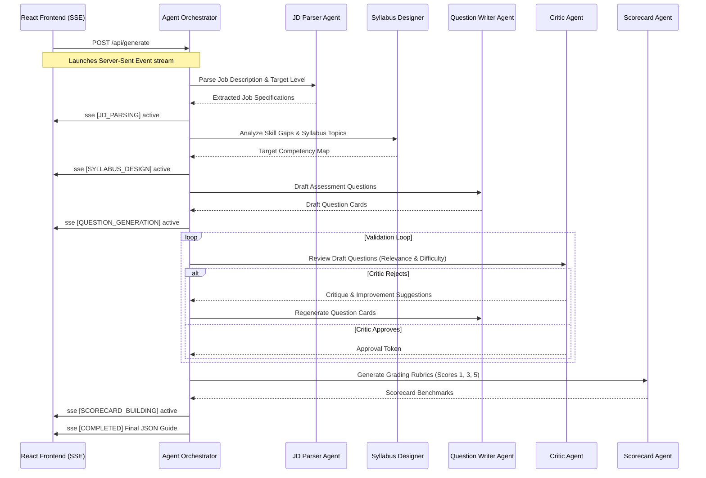

# Techno-Recruit: Multi-Agent AI Talent Acquisition Platform
### Project Architecture, Tech Stack, & Implementation Report
**Developed by**: Raj Kishore S

---

## 🌌 Project Overview
**Techno Recruit** is a premium, enterprise-grade AI Talent Acquisition and Career Intelligence SaaS platform. It leverages a self-correcting **multi-agent orchestration loop** to automate the end-to-end recruitment pipeline:
1. **Career Navigator**: Tiered role suitability scoring (Junior/Mid/Senior) with resume highlights extraction (leadership, hackathons, internships) and history revision tracking.
2. **ATS Resume Enhancer**: PDF/DOCX resume audit against job descriptions with a keyword gap heatmap and a tailored ATS resume output.
3. **Talent Search (Vector RAG)**: Semantic keyword queries (e.g. *"Hackathon winners and competitive programming champions"*) matched directly against the full resume text index.
4. **Interview Architect**: Autonomous agent loop generating 6-question structured interview guides with a live question tweaker and evaluation playground sandbox.

---

## 🛠️ Technology Stack

### 1. Frontend Architecture
- **Framework**: React 18+ powered by **Vite** for optimized builds and fast module reloading.
- **Routing**: **React Router DOM** protecting pages via a unified authentication layout structure.
- **Styling**: Curated custom Vanilla CSS variables incorporating glassmorphic transparency (`blur(18px)`), interactive neon border pulses, and a cyber-tech dark theme palette (`#020617` background, `#0B1120` surface, and `#38BDF8` cyber blue accents).
- **Icons**: **Lucide React** vectors for dynamic micro-animations.

### 2. Backend Architecture
- **Framework**: **FastAPI** (Python 3.9+) supporting async event rendering.
- **Stream Event Delivery**: Server-Sent Events (SSE) yielding real-time agent execution traces to the UI.
- **LLM Integration**: **Groq API Client** running LLaMA-3 models with optimized JSON schemas and structural validators.

### 3. Database & Authentication
- **Authentication**: **Google Sign-In (Firebase Auth)**. Includes an optional authorization fallback supporting anonymous guest sessions.
- **Database Engine**: A **Dual-Persistence Layer** that synchronizes all candidate runs and guides to **Cloud Firestore** while maintaining a local file-based JSON database (`career_analyses_db.json` & `interview_guides_db.json`) as a local-development and guest fallback.

---

## 🤖 Multi-Agent Orchestration Loop

During guide generation, the backend runs a sequential multi-agent loop where specialist agents correct each other's outputs:

---

## 🚀 Key Module Implementations

### 1. Interview Architect Page (`src/pages/InterviewArchitect.jsx`)
- **Pipeline Stepper**: A horizontal timeline flowchart using Lucide icons. Finished stages show green outlines and checkmarks, while the active stage glows with a cyan pulse animation.
- **Live Question Tweaker**: Allows recruiters to adjust difficulty level or request rewrites in-place via `/api/tweak` API hooks.
- **Evaluation Sandbox Playground**: Recruiters can test candidate responses. The backend `/api/evaluate` agent rates the answer from 1-5, lists strengths and weaknesses, highlights red flags, and proposes follow-up questions.
- **Export Formats**: Seamless client-side copy-to-clipboard, Markdown downloads, and print formatting.

### 2. Talent Search Vector RAG (`agents/talent_search.py`)
- **Semantic Indexing**: When resumes are parsed (via Career Navigator or ATS optimizer), the system persists the full resume text database attribute.
- **LLM Re-ranking**: The search agent receives the recruiter's natural language query and re-ranks matching candidate profiles. It returns candidate relevance scores alongside clear textual justifications explaining why they fit the criteria.

### 3. ATS Resume Enhancer (`routes/ats_routes.py`)
- **ATS Auditing**: Evaluates resume documents, calculates ATS score metrics, reports missing keywords, and rewrites the resume into a tailored version.
- **Auto-Syncing**: Screened ATS candidate records are automatically added to the unified career history database, making them searchable by the vector search query engine.
